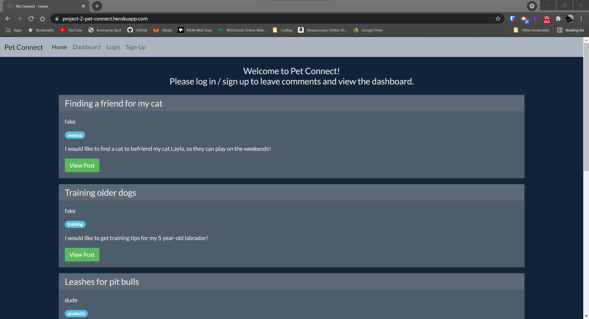

# Project 2 - Pet Connect

## Link to Deployed Application
https://project-2-pet-connect.herokuapp.com/

## Technologies Used 
- HTML / CSS / Javascript 
- Bootswatch
- Heroku
- Insomnia
- Node.js
- Bcrypt Package
- Dotenv Package
- Express Package 
- Express-Handlebars Package 
- Express-Session Package
- MySQL Package/Workbench
- Nodemailer Package 
- Sequelize Package

## Project Description 
Pet Connect is a social media application that is designed to connect pet owners. Users can create posts to plan dog walks with others, get potty training lessons, provide product information, and ask questions from other pet owners. If they’re lucky, they can even find soulmates for their pets.

### User Story
```
AS A person who owns a pet
I WANT a CMS-style blog/networking site
SO THAT I can connect with other pet owners and have discussions about my pet
```

## Screenshot


## License
MIT License

## Team Members 
- [Wendy Kobayashi](https://github.com/iamalittleforest)
- [Rod Blanco](https://github.com/rodablanco)
- [Omri Ronen](https://github.com/Omrironen4)
- [Jesus Diaz](https://github.com/J-Diaz103)
